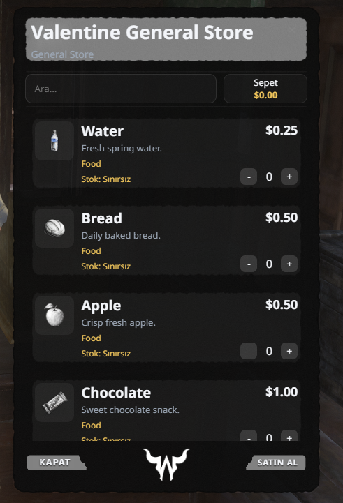

<p align="center">
  
</p>

<h1 align="center">🛒 cagan-market</h1>
<p align="center">
  <b>Modern, Configurable Store & Shopping Cart System for RedM</b><br>
  <i>Western Aesthetic Torn-Paper NUI • Multi-Framework (VORP Core & RSG-Core) • Multi-Language • Buy & Sell Modes</i>
</p>

<p align="center">
  
  
  
  
  
  
</p>

---

## 📖 Overview / Genel Bakış

**EN:**  
**cagan-market** is a feature-rich, high-performance general store, gunsmith, and trade market system built specifically for RedM. Featuring an authentic 1899 Western dark torn-paper NUI, interactive multi-item shopping cart, dynamic search, category tabs, and dual buying/selling modes. It includes a universal framework bridge that automatically detects whether your server runs **VORP Core** or **RSG-Core**, with zero configuration required.

**TR:**  
**cagan-market**, RedM sunucuları için sıfırdan geliştirilmiş, modern sepet sistemli, yırtık kağıt (torn-paper) temalı Vahşi Batı mağaza ve pazar sistemidir. Alış ve satış modları, gerçek zamanlı arama çubuğu, kategori sekmeleri, iş kısıtlamaları (job-lock) ve **VORP Core** ile **RSG-Core** otomatik algılayan evrensel framework köprüsü içerir.

---

## ✨ Features / Özellikler

- 📜 **Authentic Western Dark UI**:
  - Immersive torn-paper grunge aesthetic fitting 1899 Red Dead lore.
  - Interactive multi-item shopping cart with quantity controls (`-` / `+`).
  - Real-time cart total calculation in server currency.
  - Instant live search bar to quickly find items by label.
  - Category tabs (Food, Drinks, Medical, Tools, Weapons, Custom).
  - Stock indicators (`Stok: Sınırsız` or finite dynamic stock counts).
  - Sound effects matching native Red Dead store audio cues.

- 🔄 **Universal Multi-Framework Bridge (VORP & RSG-Core)**:
  - **Auto-Detection (`Config.Framework = 'auto'`)**: Automatically identifies the active framework at runtime.
  - **VORP Core**: Full native integration with `vorp_core` & `vorp_inventory` (carrying capacity, weight, weapon creation).
  - **RSG-Core**: Full native integration with `rsg-core` & `rsg-inventory` (QBCore-based player functions & item notifications).
  - **Image Auto-Routing**: Automatically fetches item icons from your inventory resource (`vorp_inventory/html/img/items/` or `rsg-inventory/html/images/`).

- ⚖️ **Dual Store Mode (Buy & Sell)**:
  - **Buy Mode**: General stores, gunsmiths, butchers, saloons, doctors, stables.
  - **Sell Mode**: Allows players to sell gathered resources, pelt, meat, or crops for server cash.

- 🔒 **Job & Grade Locks**:
  - Restrict specific catalogs or individual stores to designated jobs (e.g. Police Armory, Doctor Medical Depot, Blacksmith).

- 📍 **Storekeepers (NPC Peds) & Custom Map Blips**:
  - Configurable shopkeeper NPC models, coordinates, heading, and z-offsets.
  - Native RedM map blips with custom sprites, colors, and scales.
  - Smooth native hold-key interaction prompt (`[G]`).

- ⚡ **Performance & Security**:
  - **0.00 ms** resmon at idle.
  - Server-side price & inventory validation (prevents client-side tampering).
  - Inventory capacity and weight checks before completing purchases.
  - Transaction rollbacks if an error occurs.

- 📊 **Discord Webhook Logs**:
  - Rich Discord embed receipts: Player Name, Steam/License ID, Store Name, Purchased Items Breakdown, Total Price, and Timestamp.

- 🌐 **Multi-Language (i18n)**:
  - English (`en`), Turkish (`tr`), German (`de`), French (`fr`).

---

## 📸 In-Game Showcase / Görsel

<p align="center">
  
</p>

---

## 📥 Installation / Kurulum

1. **Download the resource**:
   Download the latest release or clone this repository into your RedM server's `resources` directory:
   ```bash
   cd resources
   git clone https://github.com/c4gan/cagan-market.git
   ```

2. **Add to `server.cfg`**:
   Ensure `cagan-market` starts after your framework and inventory:
   ```cfg
   # Framework & Inventory first
   ensure vorp_core         # or rsg-core
   ensure vorp_inventory    # or rsg-inventory
   ensure oxmysql

   # cagan-market
   ensure cagan-market
   ```

3. **Configure `config.lua`**:
   Open `config.lua` and adjust your preferred settings, items, prices, and language.

4. **Restart server** or run `ensure cagan-market` in the console.

---

## ⚙️ Configuration / Yapılandırma

### Basic Settings (`config.lua`)

```lua
Config = {}

-- Framework Bridge: 'auto' | 'vorp' | 'rsg'
Config.Framework = 'auto'

-- Language: 'en' | 'tr' | 'de' | 'fr'
Config.DefaultLocale = 'en'
Config.Locale = 'en'

-- Interaction Prompt Key: 0xDFF812F9 is [G]
Config.OpenKey = 0xDFF812F9
Config.OpenHoldMs = 700       -- Key hold duration (ms)
Config.OpenDistance = 3.0     -- Max interaction radius
Config.DrawDistance = 4.0     -- Prompt render distance

-- Discord Logging (Optional)
Config.DiscordLog = {
    enabled = true,
    webhook = "https://discord.com/api/webhooks/YOUR_WEBHOOK_URL_HERE",
    botName = "Valentine Storekeeper",
    botAvatar = ""
}
```

### Adding New Items to a Store Catalog

```lua
Config.MarketTypes = {
    general = {
        label = "General Store",
        items = {
            { name = "water", label = "Water", price = 0.25, description = "Fresh spring water.", category = "Food" },
            { name = "bread", label = "Bread", price = 0.50, description = "Daily baked bread.", category = "Food" },
            { name = "apple", label = "Apple", price = 0.50, description = "Crisp fresh apple.", category = "Food" },
            { name = "chocolate", label = "Chocolate", price = 1.00, description = "Sweet chocolate snack.", category = "Food" },
        }
    }
}
```

### Creating a New Store Location

```lua
Config.Shops = {
    {
        name = "Valentine General Store",
        type = "general",                       -- References Config.MarketTypes.general
        mode = "buy",                           -- "buy" or "sell"
        coords = vector3(-324.26, 804.09, 117.97),
        npcModel = "U_M_M_NbxGeneralStoreOwner_01",
        npcHeading = 270.0,
        blip = {
            enabled = true,
            sprite = joaat("blip_shop_store"),
            name = "General Store"
        },
        jobs = {}                               -- Empty table = Open to everyone
    }
}
```

---

## 📂 File Structure / Dosya Yapısı

```text
cagan-market/
├── client/
│   ├── bridge.lua        # VORP & RSG client-side framework bridge
│   └── main.lua          # NPC spawning, blips, prompts, NUI controller
├── server/
│   ├── bridge.lua        # VORP & RSG server-side inventory & cash handler
│   └── main.lua          # Purchase & Sell validation, Discord logs
├── html/
│   ├── index.html        # NUI markup
│   ├── style.css         # Western torn-paper grunge theme styles
│   ├── app.js            # Vue/Vanilla shopping cart reactive state
│   └── img/              # UI textures, torn-paper backgrounds, buttons
├── locales/
│   ├── en.lua            # English translations
│   ├── tr.lua            # Türkçe çeviriler
│   ├── de.lua            # Deutsche Übersetzungen
│   └── fr.lua            # Traductions françaises
├── shared/
│   └── locale.lua        # Modular i18n locale manager
├── docs/
│   └── preview.png       # High-res showcase image
├── config.lua            # Comprehensive store & items configuration
├── fxmanifest.lua        # Manifest definition
└── README.md             # Documentation
```

---

## 🤝 Dependencies / Gereksinimler

- **One of the following frameworks**:
  - [VORP Core](https://github.com/VORP-Core) (`vorp_core` + `vorp_inventory`)
  - [RSG-Core](https://github.com/Rexshack-RedM) (`rsg-core` + `rsg-inventory`)
- [oxmysql](https://github.com/overextended/oxmysql)

---

## 📜 License & Credits

- **Author**: `cagan`
- **License**: [MIT License](LICENSE)
- Special thanks to the RedM and CFX.re community.

Enjoy the script! If you like this project, please consider giving it a ⭐ on GitHub!
